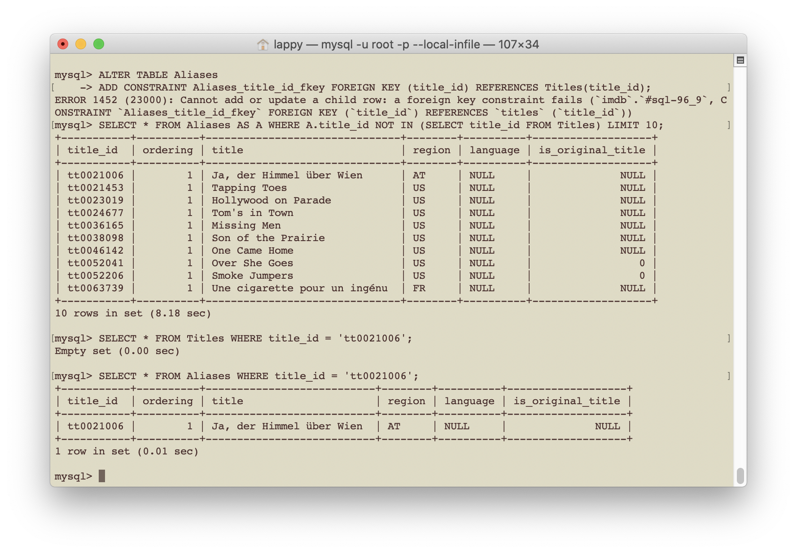
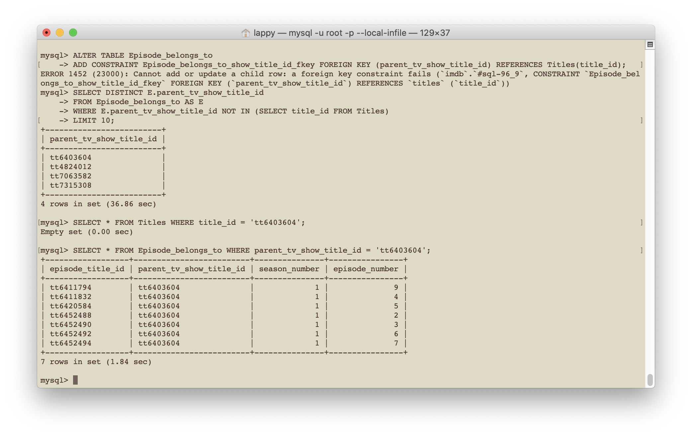
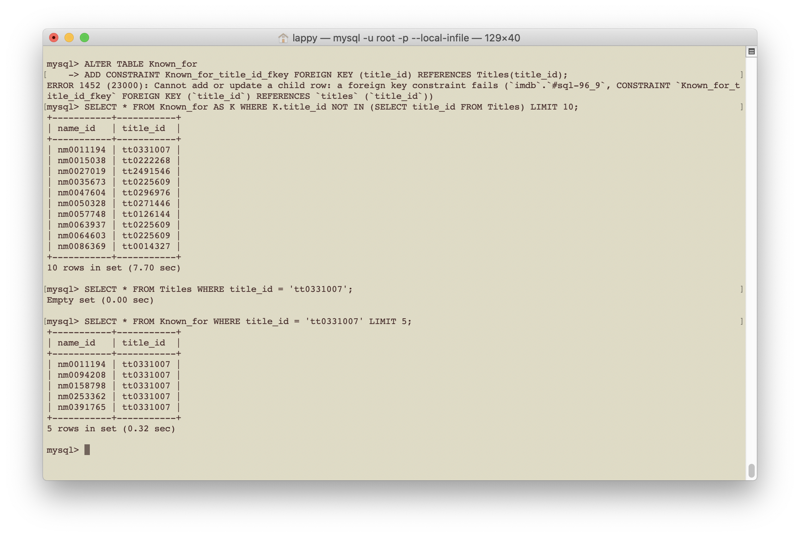
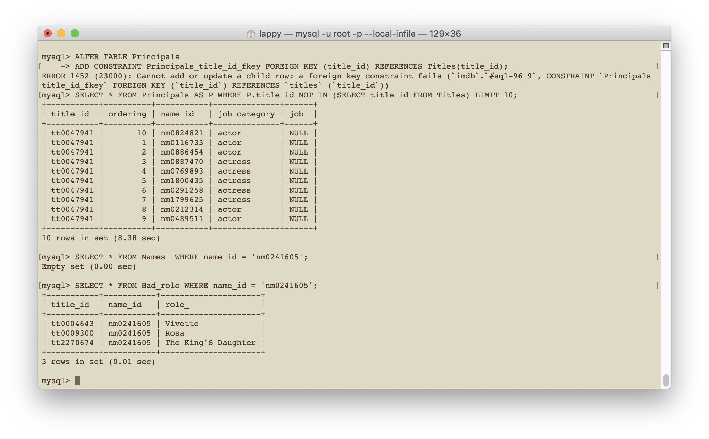
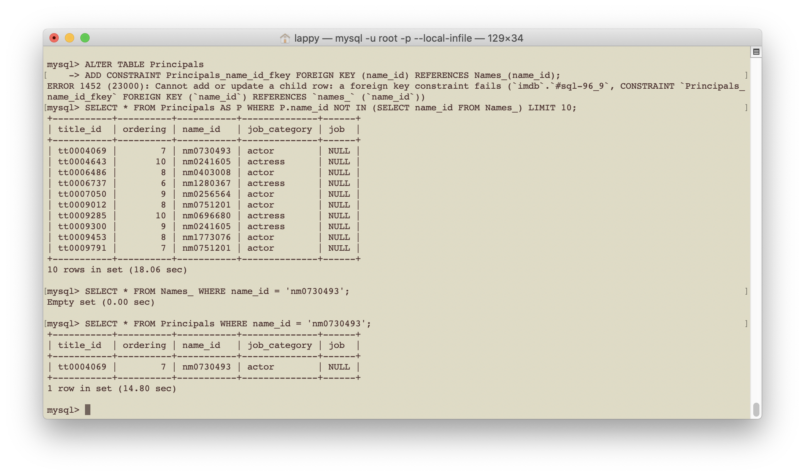
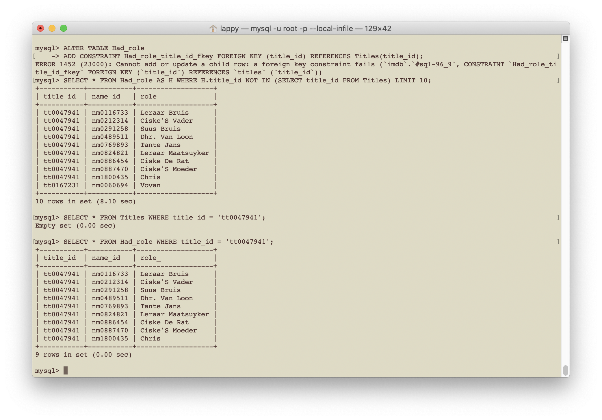
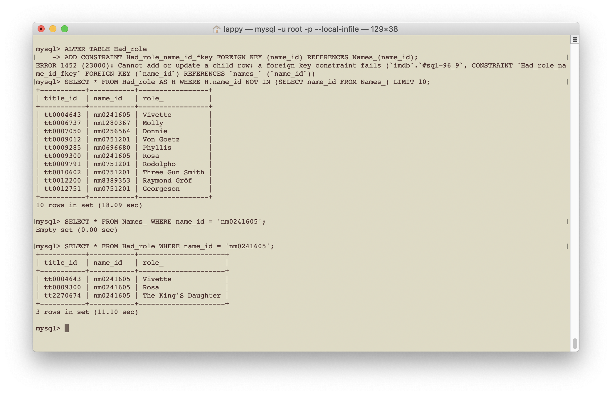
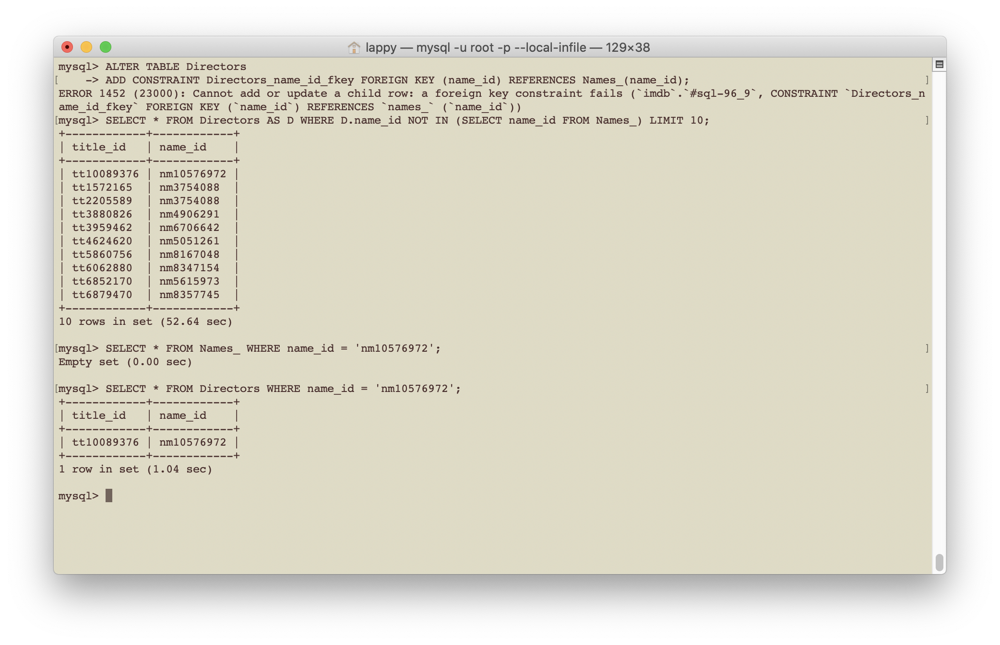
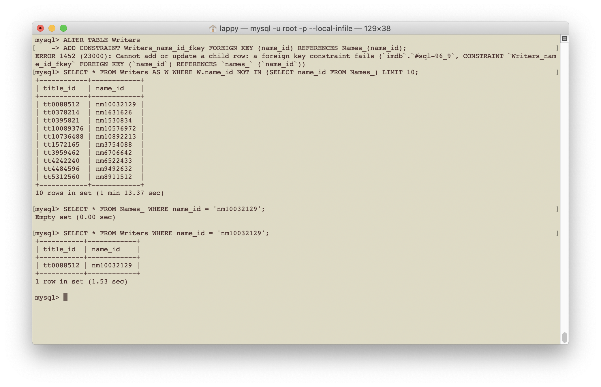

# IMDb Missing Data Issues

There is missing data in the IMDb dataset, mostly missing from the files
name.basics.tsv.gz and title.basics.tsv.gz. This missing data causes issues when
we try to impose certain foreign key constraints. These missing
data issues are illustrated below. To overcome these issues we simply disable
the foreign key checks lock, add the constraint and then re-enable the lock. This
is done by

```sqlmysql
SET foreign_key_checks = 0;

-- Add constraints ...

SET foreign_key_checks = 1;
```  

This is not ideal, rather it is done for simplicity.
Alternatively, we could scrape the missing data from the IMDb website and
combine it with the IMDb dataset. This, however, is beyond the current scope of
this project.

## Missing data in the IMDb dataset

- Aliases has titles that do not exist in Titles, i.e., there are entries in
IMDb's title.akas.tsv.gz that are not present in title.basics.tsv.gz. The same
issue arises when setting the foreign key for the Alias_attributes and
Alias_types tables.




- Ditto for Episode_belongs_to table. Also, there appears to missing details
episodes in the table. The episode data came from the datafile
title.episode.tsv.gz.



- Ditto for Known_for and missing data from Titles.



- Ditto for Principals and missing data from Titles.



- Principals has names that do not appear in Names_, i.e., there are entries in
IMDb's title.principals.tsv.gz that are not present in name.basics.tsv.gz.



- Ditto  for Had_role and missing data from Titles.



- Ditto for Had_role and missing data from Names_.



- Ditto for Directors and missing data from Names_.



- Ditto for Writers and missing data from Names_.


